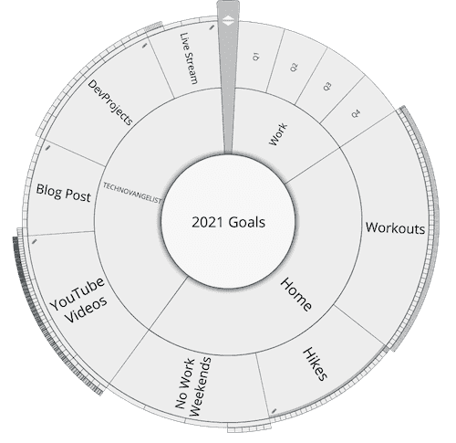

Resolutions. I don't do well with resolutions. But Goals. Goals can work...if and only if you can stay accountable to those goals. About 9 years ago, I used a tool to help me stay accountable with my goals for 2012. It was an amazing tool called [Goalscape](http://www.goalscape.com). 

I opened it this week for the first time in ages after a recent update. And it works just the same as it did back then. It's like a pie chart with concentric circles. You define your top layer goals in the inner most circles, and each circle going outwards on that pie slice gets to more and more specific sub goals. 

A goal of working out is great, but it's not very detailed. A more detailed goal of 3 times a week is great, but it's hard to see how well you are doing 6 months in. So I have a top level goal of working out, which is broken down by the 4 quarters of the year. Those 4 quarters make up the next circle on the pie slice. Then those are broken down by week number, and those are broken down by the 3 workouts for the week. I can only update progress at the most detailed levels, but that progress bubbles up to the top. So when I have done all three workouts for the week, that week shows 100% and the quarter thus shows that I have done 1/12th of the work and so on up to the top top level of 2021 goals. 

That example assumes that every detail has the same importance as every other detailed subgoal. But that isn't always the case. My home goals have higher importance to me than my work goals so they take up 45% of the pie slice. My workouts have higher importance than going out for new hikes, so it's 45% of the home slice. My [Youtube channel](https://www.youtube.com/technovangelist) is more important to me than spending more time on Twitch so it gets 35% vs 15%. When I finish a stream or take another hike or work on my next OKR at work, they all bubble up according to their special percentage to the top.

As I do the next ride on the Peloton and work on my OKRs and post new videos to YouTube, I can see at any point how well I am doing on my overall goals for the year. It may sound like a lot of busy work, but it soon becomes fun to fill in the sections. And 6 months in when you get worried about how much still needs to be done, it's incredible to see how far you have come. 

Unfortunately for the company behind the tool, it was originally based on Adobe Flash. Not sure if you remember the story, but Flash started on it's path to obsolescence around 2007 or 2008 when everyone saw the performance problems. Finally Apple acted on it and removed Flash from the iPad and iPhone in 2010. With the security issues it has had since I have been very reluctant to install Flash on the systems I use. [Adobe finally end of life'd Flash a few days ago](https://www.adobe.com/products/flashplayer/end-of-life.html).

This has meant that I haven't used Goalscape since the video I made in 2012. It's taken the company 8 years, but they finally updated it to current technology and for the first time in 8 years I can use it again. It still uses Adobe Air but doesn't use Flash. Two days ago on January 1st of 2021 I was able to get started on my goals for the new year. 

So how did I decide what I want to accomplish? I started with my big three buckets: Work, Home, and Technovangelist. At work we do quarterly OKR's. We don't decide on those until just before or days after the quarter starts, so I just put in Q1, Q2, Q3, and Q4 as placeholders. Technovangelist means everything I do for YouTube, Streaming, this blog, and Personal Dev Projects. Home is everything else. For now that is workouts, hikes, and a goal of not working on weekends. 

Is the tool perfect? Certainly not. It's got some memory leak issues so you will want to restart it every now and then as it becomes sluggish. And as you zoom in and out of the deeper subgoals, it lags a bit. It has some basic keyboard shortcuts for some things, but it's frustrating how often you need to use your mouse. And copying and pasting groups of goals is a total pain. But despite those issues I am excited about being able to use it again. 

How am I doing so far? Well the year started yesterday, so progress is barely noticeable. Although I have now written a blog post, ridden on the Peloton once, and hiked a new route with our daughter, I still have to zoom in a long way to see any forward motion. But it's early and based on my past experience I know it will be wonderful to follow later on. 

